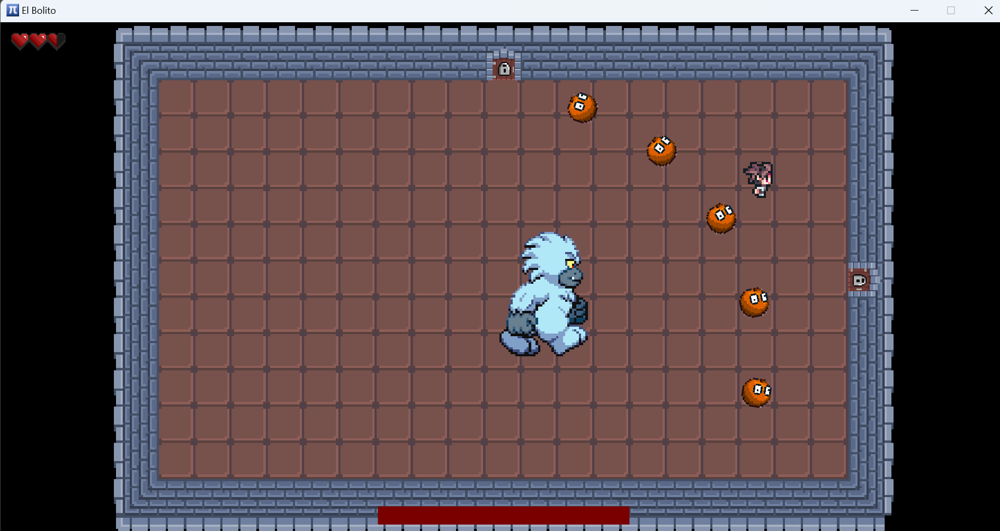

# ElBolito

## Description du jeu
Le jeu ElBolito en scala est un jeu inspiré de Binding of Isaac, où le joueur doit tuer des monstres dans plusieurs salles pour avancer.
Le joueur tombera aussi sur d'autres salles comme une salle avec un boss.

## Screenshots et vidéo du jeu

## Mode d'emploi
Utiliser les touches "W", "A", "S" et "D" pour vous déplacer.
Pour frapper, utiliser le clic gauche et pour effectuer une roulade la touche "shift gauche".
Pour changer d'arme quand l'arc est débloqué, appuyer sur "E".

## Sources

- https://o-lobster.itch.io/simple-dungeon-crawler-16x16-pixel-pack
- https://danieruart.itch.io/16x16-rpg-fantasy-character-and-tileset
- https://www.leagueoflegends.com/fr-fr/champions/gragas/
- https://opengameart.org/content/yeti-supertux-advance
- https://fliflifly.itch.io/hearts-and-health-bar
- https://www.youtube.com/watch?v=WNO5acv-uhA
- https://copilot.microsoft.com/
- https://suno.com/create
